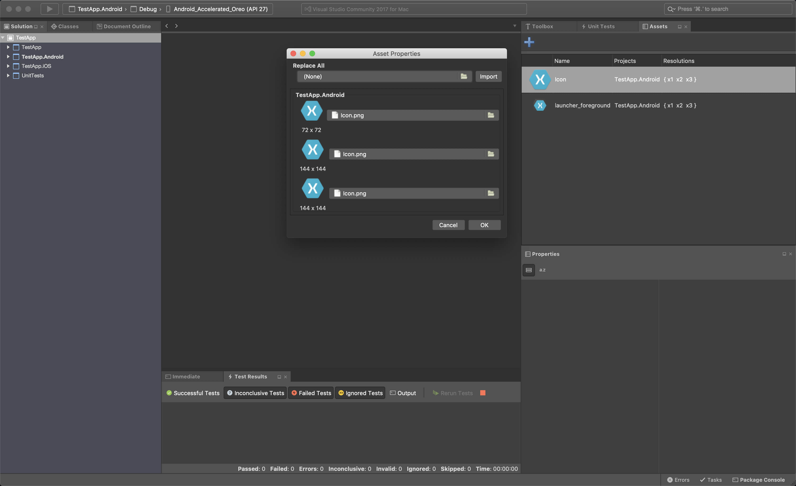

# VSMac-AssetManager (WIP⚒)

A Visual Studio for Mac extension for managing image assets in Xamarin.Android and Xamarin.iOS projects.

The extension adds an additional pad that can be used to view all the assets present within a loaded solution, along with which projects they are included in and in which resolution.

## Installing

1. Download the extension from the [Releases](https://github.com/ademanuele/VSMac-AssetManager/releases) section.

2. In Visual Studio for Mac, open `Extension Manager -> Install from file...` and install the downloaded file.

3. Restart Visual Studio for Mac

4. Done.

In order access the assets pad, navigate to `View -> Pads -> Assets`.

## Authors

* **Arthur Demanuele**

## License

This project is licensed under the MIT License - [full details](LICENSE.md).
